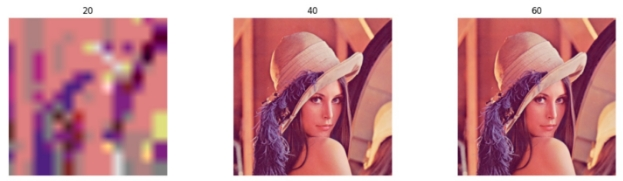

В ходе выполнения этой лабораторной работы необходимо было реализовать алгоритм кодирования/декодирования изображений на основе нейронных сетей а также сравнить качество реализованного алгоритма с jpeg2000. 

Инструкция по использованию: 

Для кодирования изображения необходимо использовать скрипт coder.py. Для задания пути к целевому изображения необходимо использовать конфигурационный файл. Также в нем можно выбрать уровень квантования и веса для этого уровня. Поддерживаются следующие значения: 4, 8, 16. 

Скрипт декодирования работает аналогичным образом. 

Для сжатия результата квантования применялся алгоритм Хаффмана. Алгоритм работает, создавая бинарное дерево узлов. Узел может быть листовым узлом или внутренним узлом. Изначально все узлы являются листовыми узлами, которые содержат сам персонаж, вес персонажа. Внутренние узлы содержат вес символов и ссылки на два дочерних узла. По общему соглашению, бит 0 представляет следующий левый дочерний элемент, и немного 1 представляет следующий правильный ребенок. Готовое дерево имеет n листовые узлы и n-1 внутренние узлы. Рекомендуется, чтобы дерево Хаффмана отбрасывало неиспользуемые символы в тексте, чтобы получить оптимальную длину кода.

Результаты:

Сжатие с помощью jpeg2000 с параметрами quality\_layers: 20, 40, 60. 

Сжатие с помощью разработанного алгоритма с квантованием: 4, 8, 16. 

